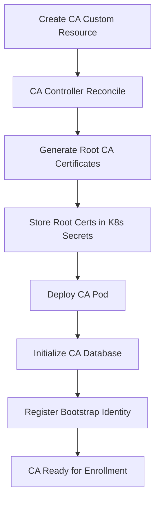
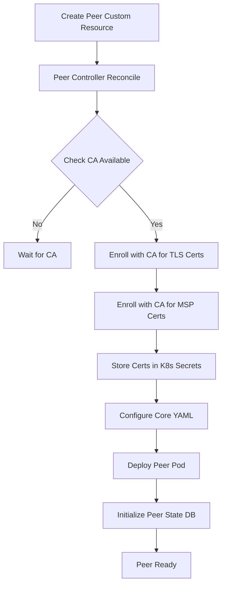
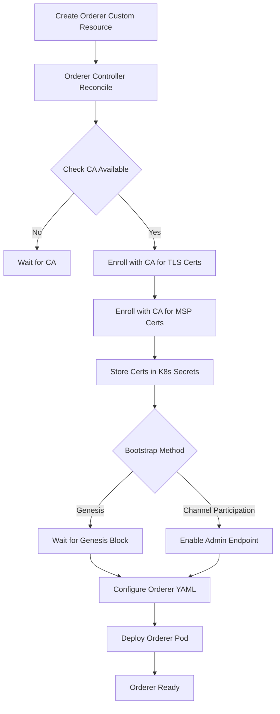

# Key Management

**1. Creating a Fabric CA**

The CA is the foundation component as it issues certificates for other components. Here's the flow:

Key Concepts:
- CA creates its own root certificates for TLS and signing
- Stores certificates in Kubernetes secrets
- Sets up initial admin identity
- Provides enrollment service for other components

**2. Creating a Fabric Peer**

Peers need both TLS and MSP certificates from a CA to operate:

Key Concepts:
- Requires CA to be available first
- Gets two types of certificates (TLS and MSP)
- Stores credentials in separate secrets
- Sets up state database (CouchDB/LevelDB)
- Configures peer with proper MSP structure

**3. Creating a Fabric Orderer**

Orderers require similar certificate setup but also need genesis block or channel participation setup:

Key Concepts:
- Similar certificate requirements to peers
- Additional bootstrap configuration needed
- Supports two bootstrap methods:
  - Genesis block (traditional)
  - Channel participation (new method)
- Admin endpoint for channel management

**Common Patterns Across All Components:**

1. **Certificate Management**:
   - All components need TLS certificates for secure communication
   - All components need MSP certificates for identity
   - Certificates are stored in Kubernetes secrets
   - Support for automatic certificate renewal

2. **Security Flow**:
   - Private keys never leave the Kubernetes cluster
   - Each component has its own unique identity
   - Supports external certificate management
   - Follows Fabric's MSP structure

3. **Operational Flow**:
   - Custom Resource creation triggers controller
   - Controller ensures prerequisites (like CA availability)
   - Manages certificate enrollment and renewal
   - Configures component-specific settings
   - Deploys pods with proper security context

4. **State Management**:
   - Controllers track component status
   - Handle upgrades and certificate renewals
   - Manage configuration updates
   - Monitor pod health and certificates

This architecture ensures secure and automated management of Fabric components while following Kubernetes best practices for secret management and component lifecycle.
